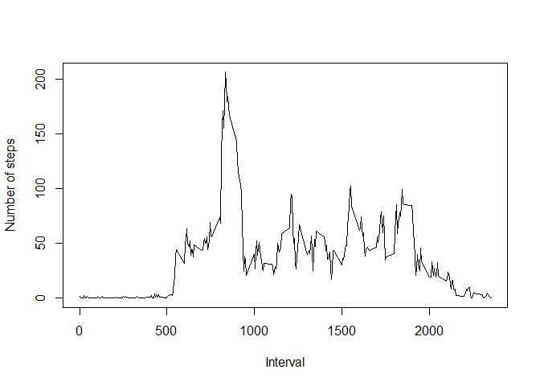

# Reproducible Research: Peer Assessment 1


## Loading and preprocessing the data

The data consists of two months of data from an anonymous
individual collected during the months of October and November, 2012
and include the number of steps taken in 5 minute intervals each day.

*1. Load the data (i.e. `read.csv()`)*


```r
activity <- read.csv('activity.csv', stringsAsFactors = F)
```
## What is mean total number of steps taken per day?

It is convenient to define a function that produces a histogram and returns a mean
and median number of steps, since the assignment calls for the same operations on two
datasets.

```r
calculate.summary <- function(activity) {
  # prep histogram and mean and median number of steps
  
  # calculate total number of steps per day
  all.steps <- tapply(activity$steps, activity$date, sum, na.rm = T)
  
  # find mean and median number of steps
  mean.steps <- mean(all.steps)
  median.steps <- median(all.steps)
  
  # produce a histogram for the daily number of steps
  hist(all.steps, col = 'green', main = "Steps taken daily", xlab = 'Steps', ylab = 'Number of days')

  return(list(mean = round(mean.steps), median = as.integer(round((median.steps)))))
}
```
*1. Make a histogram of the total number of steps taken each day.*

```r
means <- calculate.summary(activity)
```

 

*2. Calculate and report the **mean** and **median** total number of steps taken per day.*

The mean and median number of steps taken daily were 9354 and 10395, respectively.

## What is the average daily activity pattern?

*1. Make a time series plot (i.e. `type = "l"`) of the 5-minute interval (x-axis) and the average number of steps taken, averaged across all days (y-axis).*


```r
interval.steps <- tapply(activity$steps, activity$interval, mean, na.rm = T)
plot(names(interval.steps), interval.steps, type = 'l', xlab = 'Interval', 
     ylab = 'Number of steps')
```

 

```r
max.interval <- names(interval.steps)[interval.steps == max(interval.steps)]
```

*2. Which 5-minute interval, on average across all the days in the dataset, contains the maximum number of steps?*

The maximum number of steps occurred, on average, in interval 835.

## Imputing missing values
*1. Calculate and report the total number of missing values in the dataset (i.e. the total number of rows with `NA`s)*

```r
n.missing <- nrow(activity[is.na(activity$steps), ])
```
                  
The total number of missing values in the dataset is 2304.

*2. Devise a strategy for filling in all of the missing values in the dataset. The strategy does not need to be sophisticated. For example, you could use the mean/median for that day, or the mean for that 5-minute interval, etc.*

For filling in the missing values I took median number of steps for a given interval taken across all days.

*3. Create a new dataset that is equal to the original dataset but with the missing data filled in.*


```r
# let's take medians for the missing intervals
median.steps <- tapply(activity$steps, activity$interval, median, na.rm = T)

median.steps <- data.frame(median = median.steps, interval = names(median.steps))
no.missing <- merge(activity, median.steps, by = 'interval', all.x = T)
sel <- which(is.na(no.missing$steps))
if (length(sel) > 0) {
  no.missing$steps[sel] <- no.missing$median[sel]
}
no.missing <- no.missing[ , colnames(activity)]
```

*4. Make a histogram of the total number of steps taken each day and Calculate and report the **mean** and **median** total number of steps taken per day. Do these values differ from the estimates from the first part of the assignment? What is the impact of imputing missing data on the estimates of the total daily number of steps?*


```r
# create a histogram and calculate th mean and median number of steps
means.no.na <- calculate.summary(no.missing)
```

 

For the dataset with the imputed values, the mean and median number of steps were 9504 and 10395, respectively. The mean has increased by 150 steps and the median has not changed.


## Are there differences in activity patterns between weekdays and weekends?


*1. Create a new factor variable in the dataset with two levels -- "weekday" and "weekend" indicating whether a given date is a weekday or weekend day.*


```r
# convert date variable to date format
no.missing$date <- strptime(no.missing$date, format = "%Y-%m-%d")

# create a variable that says which day it was
no.missing$day <- weekdays(no.missing$date)

# create a factor variable with two levels for a weekday and weekend
no.missing$weekday <- 1
no.missing$weekday[no.missing$day %in% c('Saturday', 'Sunday')] <- 2
no.missing$weekday <- factor(no.missing$weekday, levels = c(1, 2), 
labels = c('weekday', 'weekend'))

# calculate the means by interval separately for weekend/weekday
by.weekday <- aggregate(no.missing$steps, by = list(no.missing$interval, no.missing$weekday), FUN = 'mean')
colnames(by.weekday) <- c('interval', 'weekday', 'steps')
```

*2. Make a panel plot containing a time series plot (i.e. `type = "l"`) of the 5-minute interval (x-axis) and the average number of steps taken, averaged across all weekday days or weekend days (y-axis).*


```r
require(ggplot2)
```

```
## Loading required package: ggplot2
```

```r
qplot(interval, steps, data = by.weekday, facets = .~weekday, geom = 'line')
```

 

It looks like walking is more spread out troughout the day on weedends for this person, while on weekdays there is a cluster of intervals when this person runs or walks very quickly.
